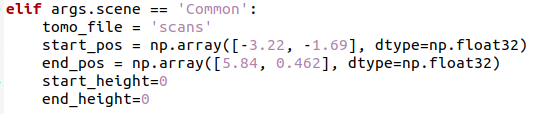
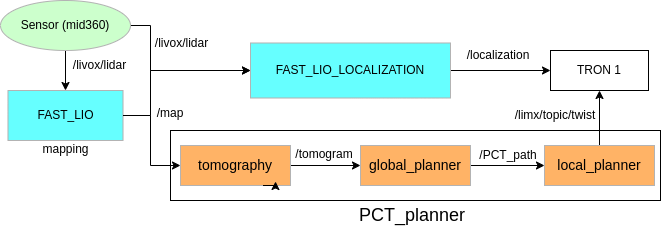

<p align="center">
    
</p>

# 3D navigation in the room and on the stairs

[](https://releases.ubuntu.com/20.04/)

## Environment
- ROS Noetic

- Ubuntu 20.04

- Lidar: Mid360

- Python >= 3.8

- CuPy with CUDA >= 11.7

- Open3d

## Overview

This repository is used to deploy 3D navigation on the bipedal wheel-robot [TRON 1](https://www.limxdynamics.com/en/tron1) in the real world. This experiment demonstrates the different navigation performances of the robot in the room and on the stairs based on [PCT_planner](https://github.com/byangw/PCT_planner) and [fast-lio2](https://github.com/hku-mars/FAST_LIO).

**Keywords:** 3D navigation, TRON 1, PCT_planner, FAST_LIO

## Installation

1. Install the necessary dependencies
```bash
sudo apt install libeigen3-dev
sudo apt install libpcl-dev
sudo apt install ros-noetic-ros-numpy
pip install numpy==1.21
pip install open3d
```

2. Clone the repository in your workspace
```bash
git clone https://github.com/81578823/3D_navigation_PCTplanner.git
```

3. Enter the workspace
```bash
catkin_make
cd PCT_planner/planner
./build_thirdparty.sh
./build.sh
```

Congratulation！ The installation has been completed. Do not forget ```source devel/setup.bash``` 

## Mapping process
1. Before mapping process, please install the livox_ros_driver2 and livox_SDK2 following the [official guidance](https://github.com/Livox-SDK/livox_ros_driver2). Open a terminal window to launch the MID360.
```bash
cd ~/ws_livox$
source devel/setup.bash
roslaunch livox_ros_driver2 msg_MID360.launch
```

2. Open a terminal window and enter the workspace 
```bash
source devel/setup.bash
roslaunch fast_lio mapping_mid360.launch
``` 
The result of the map built by fast lio will eventually be automatically saved in the PCD folder

## Localization
1. Open a new terminal
```bash
roslaunch livox_ros_driver2 msg_MID360.launch
roslaunch fast_lio_localization localization_MID360.launch 
```

2. There are two methods to localize the robot 

### method1: Use the 2d pose estimation (recommended)
<p align="center">
    
</p>

### method2: Use the command line
```bash
rosrun fast_lio_localization publish_initial_pose.py 0 0 0 0 0 0
```
[0 0 0 0 0 0]should be replaced by the estimated pose.

## Navigation

1. Copy scans.pcd from FAST_LIO/PCD to rsc/pcd in PCT planner. Then open a new terminal
```bash
cd PCT_planner/tomography/scripts
python3 tomography.py --scene Common
```
You can see the tomogram with ```rviz -d ../../rsc/rviz/pct_ros.rviz```

2. Change the directory to PCT_planner/planner/scripts. Modify the end and start position in global_planner.py
<p align="center">
    
</p>

Then ```python3 global_planner.py --scene Common```. You can see a pct_path in the rviz.

3. Launch the base_link and base_footprint of your robot. As for TRON 1, we just follow the [official guidance](https://github.com/limxdynamics/pointfoot-sdk-highlevel) to launch the highlevel SDK.
In a new terminal window
```bash
export LD_LIBRARY_PATH=$LD_LIBRARY_PATH:/YOUR/DIRECTORY/TO/PCT_planner/planner/lib/3rdparty/gtsam-4.1.1/install/lib
python3 local_planner.py
```
For convenience, please add ```export LD_LIBRARY_PATH=$LD_LIBRARY_PATH:/YOUR/DIRECTORY/TO/PCT_planner/planner/lib/3rdparty/gtsam-4.1.1/install/lib``` to ~/.bashrc. Do not forget ```source ~/.bashrc```

### Overview of the navigation frame
<p align="center">
    
</p>

## Video Demonstration

- **Navigation in the room**

https://github.com/user-attachments/assets/9cc8797a-0ef1-41de-a9bb-ca349c64954c


- **Navigation on the stairs**

https://github.com/user-attachments/assets/1f55a9ab-1768-40ba-a0ac-97dde8c26c4d


## Reference
```
@ARTICLE{yang2024efficient,
  author={Yang, Bowen and Cheng, Jie and Xue, Bohuan and Jiao, Jianhao and Liu, Ming},
  journal={IEEE/ASME Transactions on Mechatronics}, 
  title={Efficient Global Navigational Planning in 3-D Structures Based on Point Cloud Tomography}, 
  year={2024},
  volume={},
  number={},
  pages={1-12}
}
```

```
@ARTICLE{9697912,
  author={Xu, Wei and Cai, Yixi and He, Dongjiao and Lin, Jiarong and Zhang, Fu},
  journal={IEEE Transactions on Robotics}, 
  title={FAST-LIO2: Fast Direct LiDAR-Inertial Odometry}, 
  year={2022},
  volume={38},
  number={4},
  pages={2053-2073},
  keywords={Laser radar;Robots;Real-time systems;Feature extraction;Data structures;Point cloud compression;Kalman filters;Aerial systems;sensor fusion;simultaneous localization and mapping (SLAM)},
  doi={10.1109/TRO.2022.3141876}}
```


